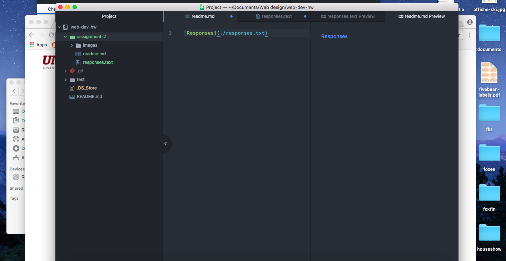

# Assignment 2

A Version Control System keeps record of all of the changes within a repository and allows for collaboration between anyone. It keeps track of the time of all the changes, who made the changes, and what the changes were in a way that makes it easy to merge code and work together. This is nice for our class because it allows us to keep a good record of what is going on and help each other out.

### Work Cycle:
This work cycle I basically just followed the directions for everything. I am very new at this but I didn't feel as though I had much difficulty with anything and was able to figure out any small things I did wrong within a short amount of time. I formatted the responses using level three headers to pose the questions then bullet points for the answers, which I thought made it look nicer.

[Here are my responses for web protocol and all that jazz](./responses.txt)

