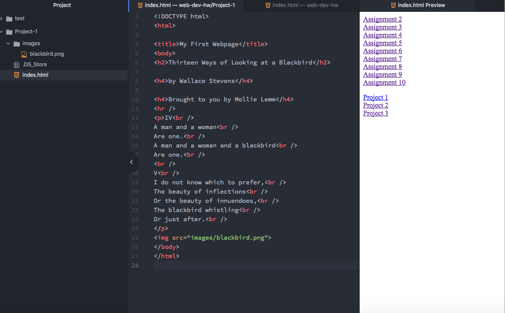

## Project-1: an epic tale
### by Mollie Lemm
___
### Browsers
The only browser I ever really use is chrome, except for when I am working with banner, in which case I have to use Safari to run the Java plugin.

Browsers function by presenting web resources. They interpret HTML and CSS files and present the material in a viewable way. This can cause compatibility issues when different browsers view things differently.
___
### Wayback Machine
I visisted the University of Montana's website back in 1998. It looks absolutely terrible. Not only is the design atrocious, the photos and graphics are hazy and ugly. Now, cascade makes it look decent and at least somewhat organized.
___
### Work Cycle
- I started by going through the website and doing all of them different activities, which I feel like helped me develop and good sense of what I was doing. I then did the project-1, which I found to be relatively easy. I really didn't run into much difficulty there.
- The one thing I did have trouble with was figuring out how to make my index.html a live page because when I clicked on my page, it just kept showing up as the first index with the list of assignment and project links. I ended up just going into that in atom and linking my index from project-1 to the project-1 link on the first index, and then bam, it worked.
- I really enjoyed getting to see the result of my work in the browser.
- I didn't post any of my problems in the repo because I figured out the only problem I had fairly quickly.

