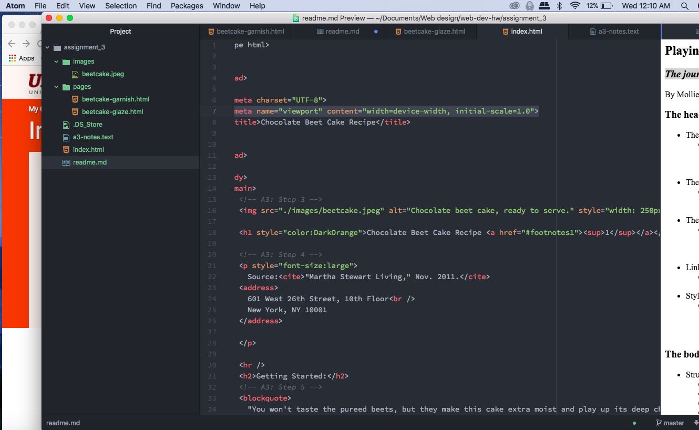

<h2>Playing with Fire</h2>
 <h3><i>The journey of html discovery</i></h3>
  
By Mollie Lemm

  <h3>The head contains:</h3>
   <ul>
    <li>The meta</li>
      <ul><li>Contains information about the page which is invisible to viewers but helps search engines</li></ul>
    <li>The viewport</li>
      <ul><li>A meta element that allows the page to adapt to different screen sizes</li></ul>
    <li>The title</li>
      <ul><li>Defines the title in the browser bar and the title that will show up on search engines</li></ul>
    <li>Link</li>
      <ul><li>Tells the browser of other resources it needs to load</li></ul>
    <li>Style</li>
      <ul><li>Allows for simple style definitions to be established without linking to an external document</li></ul>
   </ul>
<h3>The body contains:</h3>
 <ul>
  <li>Structural markup</li>
    <ul><li>Headings</li></ul>
    <ul><li>Paragraphs</li></ul>
    <ul><li>Breaks</li></ul>
    <ul><li>Lists</li></ul>
  <li>Semantic markup</li>
    <ul><li>Bold and strong</li></ul>
    <ul><li>Italics and emphasis</li></ul>
    <ul><li>Superscript and subscript</li></ul>
    <ul><li>Quotes</li></ul>
    <ul><li>Abbreviations and Acronyms</li></ul>
    <ul><li>Citations</li></ul>
    <ul><li>Definitions</li></ul>
    <ul><li>Addresses</li></ul>
    <ul><li>Insert and delete</li></ul>
    <ul><li>Strikethrough</li></ul>

Structural markup is the meat and bones of the page. It contains the actual words, the headings and paragraphs. Semantic markup denotes how those words are presented.

<h3>My Work Cycle:</h3>

I looked through and watched all of the tutorial videos and pages and then like four days later started my assignment, which, looking back, made it a little more difficult. I followed the steps for the assignment and only got confused a few times, but with a little digging, I figured everything out. I accidently left off some tags for the lists and had to go through and sort all of that out. All in all, whilst it was quite time consuming, there were no major difficulties.

