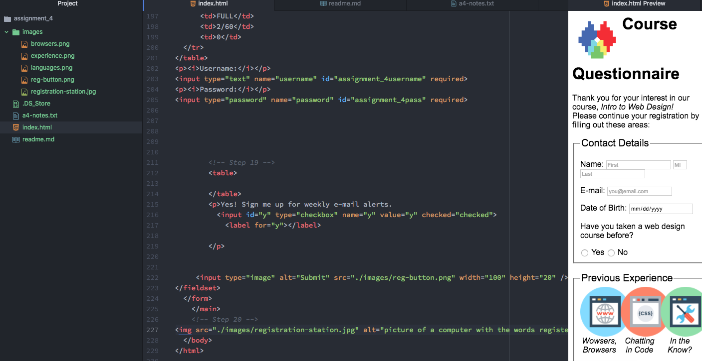

<h1>DEaTh</h1>
<h3>Alt-text</h3>

 Alt-text is used to describe an image. We use it so that people using screen readers or who are impaired will know what the image is. At times, if the browser won't display the actual image, it will display this.

<h3>Forms</h3>

  There are too many forms to count. You have subscribe forms, submit forms, upload forms, search forms, find forms, which are where you press command f and find words in a page, which is my favorite, forms for filling out information, login forms..You get the picture.

<h3>Work Cycle</h3>

 To be perfectly honest, this was a terrible week for this class. Nothing about the material was particularily difficult, but the content took so long to get down and there was just a sheer quantity. My week last week was dedicated to preparing for a few different test, and my weekend was decimated by final budgeting for ASUM, where we sat in a room for 20 hours and allocated hundreds of thousands of dollars to agencies, unions and student groups. On top of that, today I was a part of an interview committee to hire a new ASUM sustainability coordinator, which went until 5:30 p.m. So after that I biked home, opened my laptop and started this entire assignment and am now just almost finished. At 10 p.m. So all the material was fine, it just wasn't a very pleasant work cycle.

