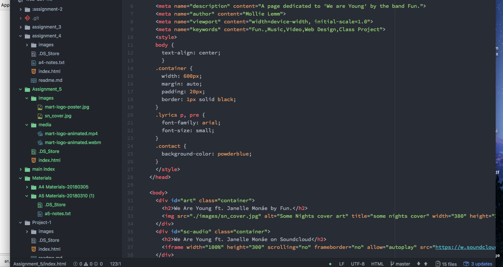

<h1>Video and Audio</h2>

<h3>Differences in divs, classes, ids, and spans</h3>

The div tag is used to block together information. The id tag is within the div tag and uniquely identifies the div set for use with CSS. The span tag puts the information on a certain segment.

<h3>Why would I choose a third party hosting site??</h3>

I personally would choose a third party hosting site because it doesn't take up my bandwidth, I don't need to worry about people downloading it, and quite frankly, it is much easier to do.

<h3>Work Cycle</h3>

For this work cycle, I chose to hightlight Fun. because I have been skiing a lot recently and it is my favorite band to listen to whilst shreddin' the gnar. During the work cycle, I ran into some problems trying to embed the animation because I didn't quite understand the type element. I worked through that by looking for examples online and seeing what I was missing. Everything else was pretty straightforward.

