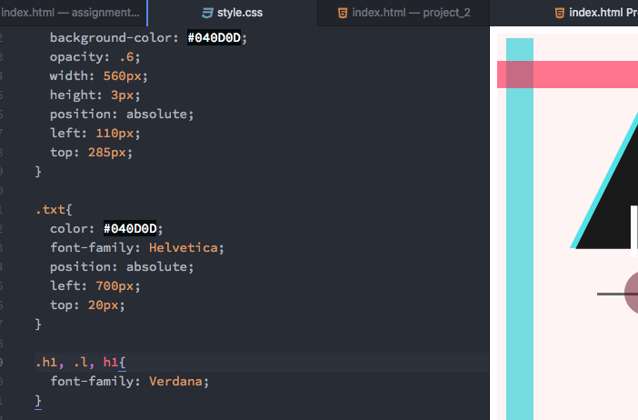

<!DOCTYPE html>

<html>
<h1>The joys of coding part 64</h1>

I liked this assignment for the most part. I chose a graphic from the 90's. I did a bit of research via the google image search "1990's graphic design" and used the shapes to inspire my work. I chose the graphic that had the letters A,B,C on it, and chose to just play around with some shapes and opacities and a string of words to make some cool shapes. I was trying to keep it at least a little basic as far as design goes because that is the type of designer I am, but I was pleased with the outcome.

<h4>Colors</h4>

I used Adobe CC color to pick my color scheme and used the graphic I chose as the template to get the colors off of, in order to keep everything in the same color scheme. The colors I used, by hex code are: #FFF3F4 (background color), #38D3D7, #FF2048, #5F0B1A, #040D0D. As you can see I have five colors listed, but two are practically black and white, so I didn't include them in the count.

<h4>Work Cycle</h4>

My work cycle was fairly easy and enjoyable. I didn't encounter any bugs and felt very prepared to begin working with CSS. I can't wait to see where it takes us next!

</html>
