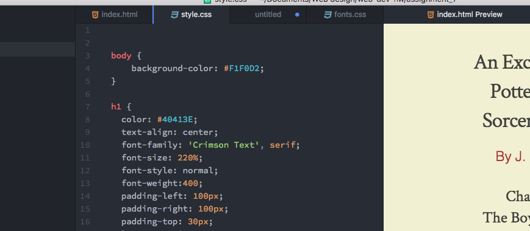

<h1>Read Me</h1>

I kinda love Harry Potter, so I chose that as my excerpt.
I chose the color scheme using a picture of the cover
of the first book and used adobe color to figure out
the exact colors, and then tweaked them to fit my needs.
I also researched the font that is used in the books and the
website and found either those fonts or ones that were close.

A system font is one found on your computer. It is probably
not on every computer, which means it isn't great for web design.
Web fonts are designed specifically for the web and are often monotype or
that sort of thing. Web-safe fonts work well with most browsers and
computers, and it's handy to use them, especially with google fonts.

It's important to have fallbacks in case a font won't load
on a specific browser.

