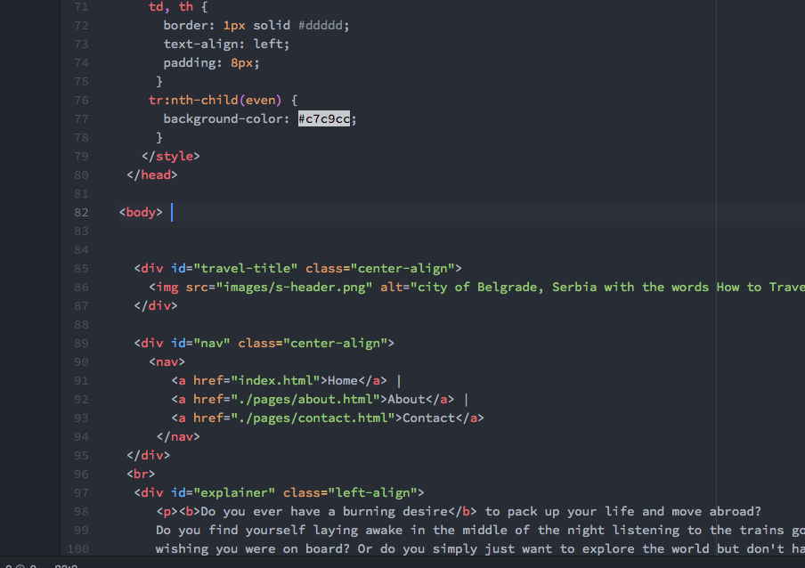

<!doctype html>
<h2>Work cycle and such for Project 2</h2>

To be quite honest I found out my childhood dog died
about an hour ago and I just want this project to be done.
This is my first ever introduction to coding and HTML. I liked
it a lot. I'm excited to learn CSS. During this last project, I
started dabbling with it and I can't wait to learn how to actually
control all of the different elements.

I spent a lot of time on this project, probably more than I needed to
but learning coding isn't about getting a grade. I'm really enjoying it and
want to keep learning more and more, so I don't mind putting in the extra hours.
I had a few different ideas in mind when I started out and eventual decided
to do a sort of "how to" on cheap traveling. I love traveling so the website
was fun to make. I had a lot of difficulty with different elements, especially
when I was trying CSS and I used google a lot to solve problems. I feel like I'm really
getting a grip on coding and I like that.

 
